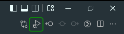

# Auto JS Unit Tests

Run JavaScript unit tests from VSCode

## Features

This extension allows running unit tests specifically for the open file directly from the Visual Studio Code with a press of one button.

A button is added in the top right corner, as marked on the image, that runs the specified command for the open file, by default `yarn test ${filePath}`.

## Extension Settings

You can customize the extension with these commands:

- `autoTests.testCommand`: The command that will run the tests for a specific file, by default `yarn test`.

## Release Notes

### 1.0.0

Initial release of Auto Unit Tests:

- Test button has been added
- Settings for configuration of the test command

## For more information

- [GitHub Page](https://github.com/spylix/vscode-autotests)

**Enjoy!**
